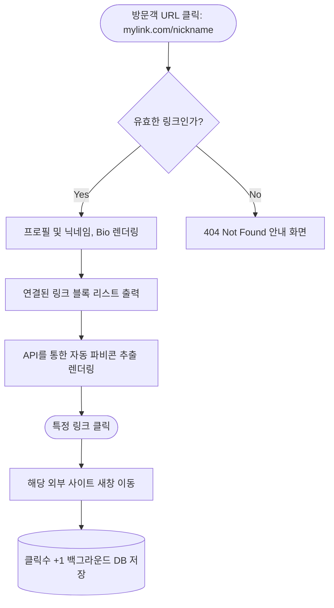
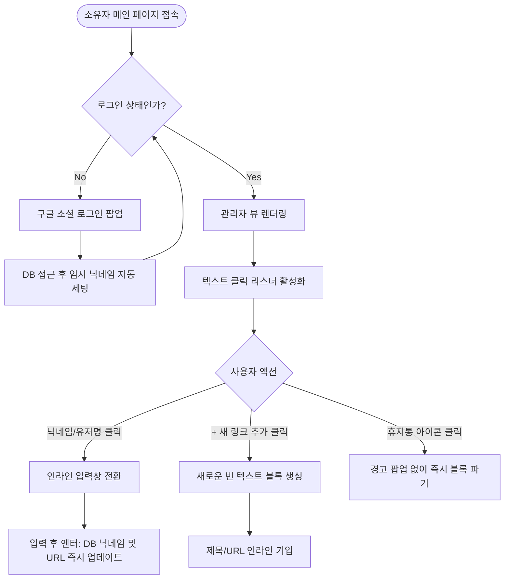

# 마이 링크 (My Link) - 화면 와이어프레임 및 흐름도

본 문서는 PRD와 사용자 시나리오 기반으로 구상된 마이 링크의 작동 흐름과 화면 UI 설계를 정의합니다. 선택하신 **A안**에 따라, 각 화면별 머메이드 흐름도를 상단에 먼저 제공하여 이해를 돕습니다.

---

## 1. 방문자 뷰 (Visitor View)

### 1-1. 화면 접근 및 상호작용 흐름도 (Mermaid)



### 1-2. 방문자용 UI 와이어프레임 (ASCII Art)

방문자가 마주하게 될 심플하고 직관적인 결과 화면입니다. 테마나 불필요한 기능 없이 정보 전달에 초점을 맞춥니다.

```text
+-------------------------------------------------------------+
|                                                             |
|                          닉네임(displayName)                   |
|                   Frontend Developer & Creator              |
|                                                             |
|   +-----------------------------------------------------+   |
|   |  [🌐]  내 기술 블로그 (Velog)                           |   |
|   +-----------------------------------------------------+   |
|                                                             |
|   +-----------------------------------------------------+   |
|   |  [🐈]  Github Repository                            |   |
|   +-----------------------------------------------------+   |
|                                                             |
|   +-----------------------------------------------------+   |
|   |  [💻]  진행 중인 오픈소스 프로젝트                         |   |
|   +-----------------------------------------------------+   |
|                                                             |
|                                                             |
|                     Powered by My Link                      |
+-------------------------------------------------------------+
```
*(참고: `[🌐]` 등은 구글 API를 통해 실제 사이트에서 불러온 파비콘 위치를 의미합니다)*

---

## 2. 소유자 뷰 (Owner / Admin View)

### 2-1. 온보딩 및 인라인 편집 흐름도 (Mermaid)



### 2-2. 소유자용 인라인 편집 UI 와이어프레임 (ASCII Art)

드래그 기능을 모두 버리고 텍스트박스 인라인 클릭 수정과 즉각 삭제(🗑️)에 집중한 관리자 화면입니다.

```text
+-------------------------------------------------------------+
|  내 링크 주소: mylink.com/닉네임             [로그아웃]       |
+-------------------------------------------------------------+
|                                                             |
|                  [ 닉네임 ✏️ (클릭하여 수정) ]                  |
|          [ Frontend Developer & Creator ✏️ (클릭하여 수정)] |
|                                                             |
|  +-------------------------------------------------------+  |
|  |           + 새 링크 추가하기                          |  |
|  +-------------------------------------------------------+  |
|                                                             |
|   +-----------------------------------------------------+   |
|   |  [🌐]  [내 기술 블로그 (Velog)            ✏️]       |🗑️|   |
|   |        [https://velog.io/@myblog         ✏️]          |   |
|   +-----------------------------------------------------+   |
|                                                             |
|   +-----------------------------------------------------+   |
|   |  [🐈]  [Github Repository                 ✏️]       |🗑️|   |
|   |        [https://github.com/my-repo       ✏️]          |   |
|   +-----------------------------------------------------+   |
|                                                             |
+-------------------------------------------------------------+
```
*(기능 명세)*
*   `[ 내용 ✏️ ]` : 별도의 팝업이나 모달이 뜨지 않고 마우스로 글자를 누르는 순간 일반 텍스트가 `<input type="text">` 창으로 깜빡이게 전환되는 인라인 편집 가능 영역입니다. 
*   `|🗑️|` : 휴지통 버튼으로, 누르면 즉각 해당 링크 도큐먼트가 삭제되며 화면에서 걷혀 사라집니다.
